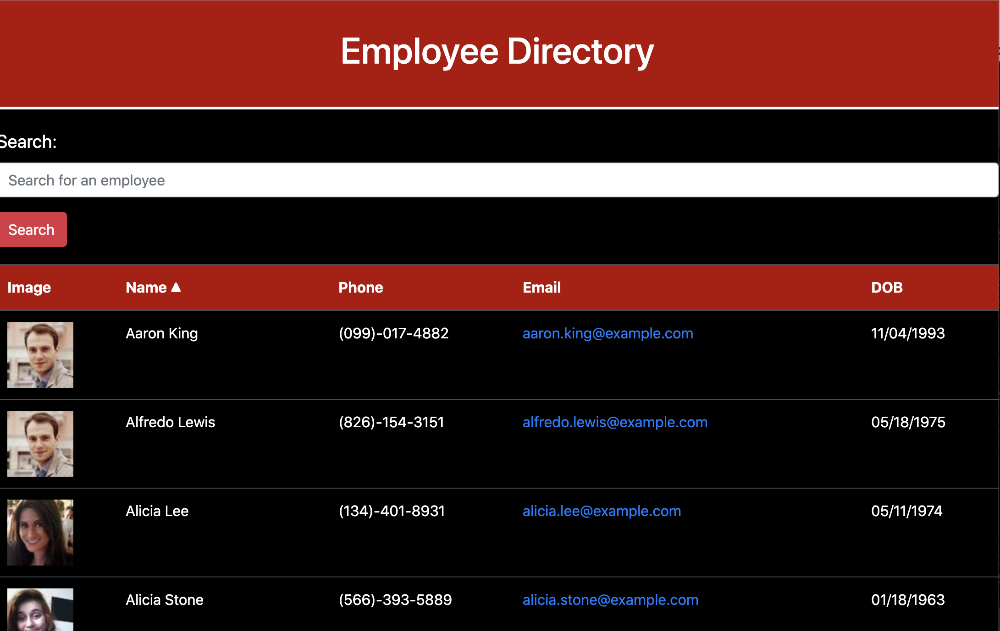

  # employee-directory
  ## Description 
  I created an employee directory using React. It uses the Random User Generator API. You can conveniently see your employees first and last names, email, date of birth, and phone number. 
  ## Table of Contents 
  * [Installation](#installation) 
  * [Usage](#usage) 
  * [Example](#example)
  ## Installation
  You first need to run npm install to install all the dependencies, then start the server by running npm start.
  ## Usage
  Once the app is running, it will show you all of the employees. You can search through employees by name, or filter their names in alphabetical order by clicking on the carrot next to the name.
  ## Example
  
   